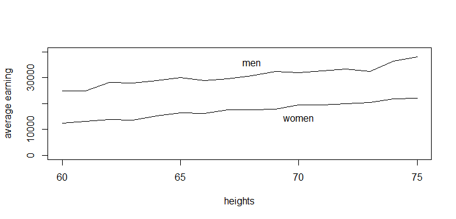

```{r setup, cache = F, echo = F, message = F, warning = F, tidy = T}
# make this an external chunk that can be included in any file
options(width = 100)
par(mar=c(5,4,1,2))
opts_chunk$set(message = F, error = F, warning = F, comment = NA, fig.align = 'center', dpi = 100, tidy = F, cache.path = '.cache/', fig.path = 'fig/')

options(xtable.type = 'html')
knit_hooks$set(inline = function(x) {
  if(is.numeric(x)) {
    round(x, getOption('digits'))
  } else {
    paste(as.character(x), collapse = ', ')
  }
})
knit_hooks$set(plot = knitr:::hook_plot_html)
```


## Logistic regression: the basic
It is the standard way to model binary outcome (data $y_i$ that take value 0 or 1)

$$P(y_i=1)=logit^{-1}(X_i\beta)$$
where $X\beta$ is a ___linear predictor___.

The functional $logit^{-1}(x)=\frac{e^x}{1+e^x}$ transforms continuous values to the range (0,1) (probabilities must be between 0 and 1)

```{r plotLG1, fig.width=8, fig.height=3, eval=TRUE, echo=FALSE}
require(arm)
x=seq(-5,5, length=100)
par(mfrow=c(1,2))
  curve (invlogit(x), -5,5, main=expression(paste('y=',logit^{-1},'(x)', sep='')))
segments(0,0,0,invlogit(0), lty='dotted')
segments(-5.5,invlogit(0),0,invlogit(0), lty='dotted')
text(0.7, invlogit(0), 'slope=1/4')
  curve (invlogit(-1+0.5*x), -6,8, main=expression(paste('y=',logit^{-1},'(-1+0.5x)', sep='')))
segments(2,0,2,invlogit(-1+0.5*2), lty='dotted')
segments(-6.5,0.5,2,invlogit(-1+0.5*2), lty='dotted')
text(2.7, 0.5, 'slope=0.5/4')
```

---
## Wells in a South Asian village
* A research team measured all the wells situated in an area surrounding a village in a South Asian country and labeled them with their arsenic concentration. Then they characterized the the wells as “safe” (< 0.5 in units of hundreds of micrograms per liter) or “unsafe” (> 0.5).
* People with unsafe wells were encouraged to switch to nearby private or community
wells. A few years later, the research team returned to find out who had switched wells

```{r, histWells, fig.width=8, fig.height=3, eval=TRUE, echo=FALSE}
wells=read.table('data/wells.dat')
with(wells, hist(dist))
```

---
## Wells in a South Asian village
```{r, eval=TRUE, echo=TRUE}
wells=read.table('data/wells.dat')
head(wells)
```
---

## Building a logistic regression model
```{r, eval=TRUE, echo=TRUE}
fit.1=glm(switch~dist, family=binomial(link='logit'), data=wells)
display(fit.1)                                      
```


---
```{r, eval=TRUE, echo=TRUE}
wells$dist100=wells$dist/100
fit.1=glm(switch~dist100, family=binomial(link='logit'), data=wells)
display(fit.1)                                      
```

---
## Graphing the fitted model
```{r, eval=FALSE, echo=TRUE}
jitter.binary=function(a, jitt=.05){
ifelse(a==0, runif (length(a), 0, jitt), runif(length(a), 1-jitt, 1))
}

switch.jitter=jitter.binary(switch)
with(wells, plot(dist, switch.jitter))
curve (invlogit (coef(fit.1)[1] + coef(fit.1)[2]*x), add=TRUE)
``` 

---
```{r, fig.width=8, fig.height=5, eval=TRUE, echo=FALSE}
fit.1=glm(switch~dist, family=binomial(link='logit'), data=wells)
jitter.binary=function(a, jitt=.05){
ifelse(a==0, runif(length(a), 0, jitt), runif(length(a), 1-jitt, 1))
}

switch.jitter=jitter.binary(wells$switch) 
with(wells, plot(dist, switch.jitter, ylab='Probability'))
curve (invlogit(coef(fit.1)[1] + coef(fit.1)[2]*x), add=TRUE)
```

---
```{r, eval=TRUE, echo=TRUE}
fit.1=glm(switch~dist100, family=binomial(link='logit'), data=wells)
display(fit.1)                                      
```

---
## probit or logit?

```{r, eval=TRUE, echo=TRUE}
require(arm)
probit.mod=glm(switch~dist100, family=binomial(link='probit'), data=wells)
display(probit.mod)
```

---
## Probit model 
* The __probit__ model is the same as the logit one, except it replaces the logistic link function with the normal distribution. 
* It is usually applied when it turns to be useful the latent-data formulation

$$
y_i=1 \quad z_i>0\\
y_i=0 \quad z_i<0
$$

$$
z_i=X_i\beta+\epsilon_i
$$

$$
\epsilon_i\sim N(0,1)
$$

In this formulation, $y_i$ is associated to a continuous, unboserved outcome $z_i$ (Latent data formulation).
In the logit model, the latent errors $epsilon_i$ have the logistic probability distribution whereas in the probit model they have a normal distribution with mean 0 and variance 1.

---
## probit or logit?
* The choice of logit or probit link function is a matter of taste or convenience, for example in interpreting the latent normal errors. 
* When we see probit regression coefficients, we can simply multiply them by 1.6 to obtain the equivalent logistic coefficients.

--- 
## Alternative functions

```{r, eval=TRUE, echo=TRUE}
require(rms)
options(datadist='dd')
dd=datadist(wells)

fit.lrm1=lrm(switch~dist, data=wells)
summary(fit.lrm1)
```

--- 
## Graphing the fitted model
```{r, plotLRM1, fig.height=4, eval=TRUE, echo=TRUE}
plot(Predict(fit.lrm1, fun=plogis), ylab='Probability')
```

---
```{r, eval=FALSE, echo=TRUE, tidy=FALSE}
fit.lrm2=lrm(switch~dist+arsenic, data=wells)

jitter.bin=function(y, jitt=.05){
  ifelse (y==0, runif (length(y), 0, jitt), runif (length(y), 1-jitt, 1))}

my.panel.dist=function(...){
  with(wells, 
  lpoints (dist, jitter.bin(switch, jitt=0.05), pch=20, cex=.1))}

plot(Predict(fit.lrm2, dist=NA, arsenic=c(0.5,1), fun=plogis), ylim=c(0,1), 
     ylab='Probability of switching',xlab='Distance', 
     label.curves=list(labels=c('As=0.5','As=1')), addpanel=my.panel.dist)
  
my.panel.as=function(...){
  with(wells, 
  lpoints (arsenic, jitter.bin(switch, jitt=0.05), pch=20, cex=.1))
  }

plot(Predict(fit.lrm2, dist=c(0,50), arsenic=NA, fun=plogis), ylim=c(0,1), 
     ylab='Probability of switching',xlab='Arsenic concentration', 
     label.curves=list(labels=c('dist=0','dist=50')), addpanel=my.panel.as)
```

---
```{r, plotLRM2, fig.width=10, fig.height=5, eval=TRUE, echo=FALSE, tidy=TRUE}
fit.lrm2=lrm(switch~dist+arsenic, data=wells)
jitter.bin=function(y, jitt=.05){
  ifelse (y==0, runif (length(y), 0, jitt), runif (length(y), 1-jitt, 1))}

my.panel.dist=function(...){
  with(wells, 
  lpoints (dist, jitter.bin(switch, jitt=0.05), pch=20, cex=.1))}

plot.dist=plot(Predict(fit.lrm2, dist=NA, arsenic=c(0.5,1), fun=plogis), ylim=c(0,1), 
               ylab='Probability of switching', xlab='Distance', label.curves=list(labels=c('As=0.5','As=1')), addpanel=my.panel.dist)
  
my.panel.as=function(...){
  with(wells, 
  lpoints (arsenic, jitter.bin(switch, jitt=0.05), pch=20, cex=.1))
  }


plot.as=plot(Predict(fit.lrm2,  arsenic=NA, dist=c(0,50),fun=plogis), ylim=c(0,1), ylab='Probability of switching', xlab='Arsenic concentration', label.curves=list(labels=c('dist=0','dist=50')), addpanel=my.panel.as)

require(gridExtra)
grid.arrange(plot.dist, plot.as, ncol=2)

```

---
## Adding interaction
```{r, tidy=TRUE}
fit.lrm3=glm(switch~dist100*arsenic, data=wells, family='binomial')
display(fit.lrm3)
```


---
## Adding interaction
```{r, tidy=TRUE}
fit.lrm3=lrm(switch~dist*arsenic, data=wells)
summary(fit.lrm3)
```

---
```{r, eval=FALSE, tidy=TRUE}
p1=plot(Predict(fit.lrm3, dist=NA, arsenic=c(0.5,1), fun=plogis), 
        
        label.curves=list(labels=c('As=0.5','As=1')), xlab='Distance', 
        
        ylab='Probability of switching')

p2=plot(Predict(fit.lrm3, arsenic=NA, dist=c(0,50), fun=plogis), 
        
        label.curves=list(labels=c('dist=0','dist=50')), xlab='Arsenic concentration', 
        
        ylab='Probability of switching')

require(gridExtra)
grid.arrange(p1, p2, ncol=2)
```

---
```{r, plotLrmInteraction, fig.width=10, fig.height=5, eval=TRUE, echo=FALSE, tidy=TRUE}
p1=plot(Predict(fit.lrm3, dist=NA, arsenic=c(0.5,1), fun=plogis), label.curves=list(labels=c('As=0.5','As=1')), xlab='Distance', ylab='Probability of switching')
p2=plot(Predict(fit.lrm3, arsenic=NA, dist=c(0,50), fun=plogis), label.curves=list(labels=c('dist=0','dist=50')), xlab='Arsenic concentration', ylab='Probability of switching')
require(gridExtra)
grid.arrange(p1, p2, ncol=2)
```

---
## For the sake of interpretation
```{r, tidy=TRUE, echo=TRUE}
wells$dist100=wells$dist/100
wells$dist100.c=wells$dist100-mean(wells$dist100)
wells$arsenic.c=wells$arsenic-mean(wells$arsenic)

fit.lrm3=lrm(switch~dist100.c*arsenic.c, data=wells)
```

```{r, tidy=TRUE, eval=FALSE, echo=TRUE}
print(fit.lrm3)
```

---
```{r, tidy=TRUE, echo=FALSE}
print(fit.lrm3)
```


---
## Adding social predictors
```{r, tidy=TRUE}
dd=datadist(wells)
fit.lrm4=lrm(switch~dist*arsenic+assoc+educ, data=wells)
```

```{r, tidy=TRUE, eval=FALSE, echo=TRUE}
print(fit.lrm4)
```

---
```{r, tidy=TRUE, eval=TRUE, echo=FALSE}
print(fit.lrm4)
```

---
## Evaluating the fitted logistic model
```{r, plotbinned, fig.width=10, fig.height=4, tidy=TRUE}
fit.lrm4=lrm(switch~dist*arsenic+assoc+educ, data=wells, x=T, y=T)
residuals=resid(fit.lrm4)
par(mfrow=c(1,2))
binnedplot(wells$dist, residuals, xlab='Distance')
binnedplot(wells$arsenic, residuals, xlab='Arsenic concentration')
```

---
## Validating the model

```{r, eval=TRUE, echo=TRUE}
validate(fit.lrm4)
```

---
```{r, eval=TRUE, echo=TRUE}
v=validate(fit.lrm4, bw=T)
```

---
## Calibrating the model
```{r, plotCalibration, fig.width=10, fig.height=4, eval=TRUE, echo=TRUE}
plot(calibrate(fit.lrm4))
```

---
## Modeling nonlinear relationships
```{r}
fit.lrm5=lrm(switch~dist100*rcs(arsenic,5)+educ+assoc, data=wells, x=T, y=T)
```

```{r, tidy=TRUE, eval=FALSE, echo=TRUE}
print(fit.lrm5)
```

---
```{r, tidy=TRUE, eval=TRUE, echo=FALSE}
print(fit.lrm5)
```
---
```{r, plotRCS, fig.width=8, fig.height=5}
plot(Predict(fit.lrm5, arsenic=NA, fun=plogis), adj.subtitle=F, 
ylab='Probability of switching', xlab='Arsenic concentration')
```

---
```{r}
v=validate(fit.lrm5,bw=T)
```

---
```{r}
fit.lrm5=lrm(switch~dist100+rcs(arsenic,5)+educ, data=wells, x=T, y=T)
s.fit=fit.lrm5$stats
print(shrink<-(s.fit['Model L.R.']-s.fit['d.f.'])/s.fit['Model L.R.'])
```

---
```{r, plotCalibr5, fig.width=10, fig.height=4}
plot(calibrate(fit.lrm5))
```

---
## Nomogram
```{r, eval=TRUE}
nom=nomogram(fit.lrm5, interact=list(dist100.c=seq(0,max(wells$dist100.c), by=1), 
  arsenic=seq(0, max(wells$arsenic), by=4)), fun=plogis, 
             lp=F, fun.at=c(.01,.05,seq(.1,.9,by=.1),.95,.99), 
             funlabel='Probability of switching' )
```

```{r, eval=FALSE, echo=TRUE}
plot(nom)
```

---
```{r, plotNomogram, fig.width=10, fig.height=7, eval=TRUE, echo=FALSE}
plot(nom)
```

---
## Getting strated: runApp

```{r, eval=FALSE}
shiny::runApp('shinyapp')
```

---
## Identifiability and separation

```{r, separation, fig.width=10, fig.height=5, eval=TRUE, echo=FALSE, tidy=TRUE}
x=rnorm(60, mean =1, sd = 2)
y=ifelse(x<2,0,1)

fit.0=glm (y~x, family=binomial(link="logit"))

plot(x, y, xlab="x", ylab="y", xlim=c(-6,6), pch=20)
curve(invlogit (coef(fit.0)[1] + coef(fit.0)[2]*x), add=TRUE)
```

---
## Solution to separation problem
```{r, eval=FALSE, echo=TRUE}
library(brglm) 
# or
library(logistf)
```

Firth, D. (1993). Bias reduction of maximum likelihood estimates. Biometrika 80, 27–38

---
## Mixed continous/discrete data
```{r, eval=TRUE, echo=TRUE}
earnings=read.csv('data/earnings.csv')

```
It could be appropriate to model the variable into two steps: 
* first step: fit a logistic regression model for $P(y>0)$
* secondo step: fit a linear regression model on $log(y)$ conditional to $y>0$

---
## Mixed continous/discrete data
```{r, eval=TRUE, echo=TRUE}
earnings$earn.pos=with(earnings, ifelse(earn>0,1,0))
earnings$male=2-earnings$sex
dd=datadist(earnings)

fit.1s=lrm(earn.pos~height+male, data=earnings)

```

---
## Mixed continous/discrete data
```{r, eval=TRUE, echo=TRUE}
summary(fit.1s)

```

---
## Mixed continous/discrete data
```{r, eval=TRUE, echo=TRUE}
fit.2s=ols(log(earn)~height+male, data=earnings, subset=earn.pos==1)
summary(fit.2s)
```

---
```{r, eval=TRUE, echo=TRUE}
coef(fit.1s)
coef(fit.2s)
```

* A 70 inch-woman (178 cm) has probability $plogis(-3.76+0.08\cdot 70+1.7\cdot 0)=0.86$ of having a positive earning
* If her earning is positive then the expected value is $exp(8.15+0.02\cdot 70 +0.42\cdot 0)=14,045$

---
## How summarizing inferences
```{r, eval=TRUE, echo=TRUE}
fit.1s=glm (earn.pos ~ height + male, data=earnings, family=binomial(link="logit"))
display (fit.1s)
```

---
## How summarizing inferences
```{r, eval=TRUE, echo=TRUE}
fit.2s=lm (log(earn) ~ height + male, data=earnings, subset=earn.pos==1)
display (fit.2s)
```

---
## How summarizing inferences
```{r, eval=TRUE, echo=TRUE}
n.sim= 1000
x.new=c(1,70,1)

sim.1s=sim(fit.1s, n.sim)
sim.2s=sim(fit.1b, n.sim)

prob.earn.pos=invlogit(sim.1s@coef %*% x.new)
earn.pos.sim=rbinom (n.sim, 1, prob.earn.pos)
earn.sim=ifelse(earn.pos.sim==0, 0,
  exp(rnorm(n.sim, sim.1s@coef %*% x.new, sim.2s@sigma)))
```


---
## Computations into a function
```{r, eval=TRUE, echo=TRUE}

Mean.earn=function (height, male, sim.1, sim.2, ns.im=100){
  x.new=c(1, height, male)
  prob.earn.pos=invlogit(sim.1@coef %*% x.new)
  earn.pos.sim=rbinom(n.sim, 1, prob.earn.pos)  
  earn.sim=ifelse (earn.pos.sim==0, 0,
    exp(rnorm (n.sim, sim.2@coef %*% x.new, sim.2@sigma)))
  return(mean (earn.sim))
}
```

---
## Simulating from two-stage model
```{r, eval=TRUE, echo=TRUE}
heights=seq(60, 75, 1)
n=length(heights) 
mean.earn.female=NULL
mean.earn.male=NULL
for (i in 1:n){
  mean.earn.female[i]=Mean.earn (heights[i], 0, sim.1s, sim.2s)
  mean.earn.male[i]=Mean.earn (heights[i], 1, sim.1s, sim.2s)
}
```


---
## More elegant
```{r, eval=TRUE, echo=TRUE}
heights=seq(60, 75, 1)
mean.earn.female=sapply (heights, Mean.earn, male=0, sim.1s, sim.2s)
mean.earn.male=sapply (heights, Mean.earn, male=1, sim.1s, sim.2s)
```

---
## Graphing the simulation
```{r, fig.width=10, fig.height=4, eval=FALSE, echo=TRUE}
plot (heights, mean.earn.female, type="l", ylim=c(0,40000), ylab='average earning')
lines(heights, mean.earn.male)
text(x=c(68,70), y=c(mean(mean.earn.male)+5000, mean(mean.earn.female)-3000),
       labels=c('men','women'))
```


