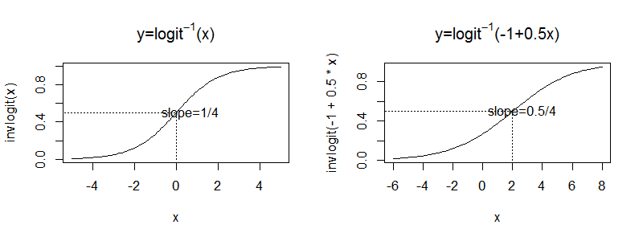
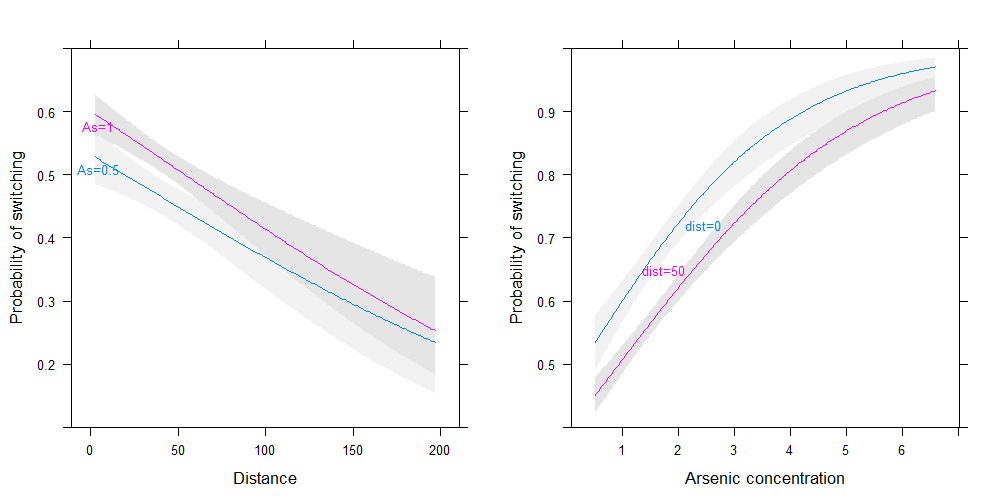

## Logistic regression: the basic
It is the standard way to model binary outcome (data $y_i$ that take value 0 or 1)

$$P(y_i=1)=logit^{-1}(X_i\beta)$$
where $X\beta$ is a ___linear predictor___.

The functional $logit^{-1}(x)=\frac{e^x}{1+e^x}$ transforms continuous values to the range (0,1) (probabilities must be between 0 and 1)

<div class="rimage center"></div>


---
## Wells in a South Asian village
* A research team measured all the wells situated in an area surrounding a village in a South Asian country and labeled them with their arsenic concentration. Then they characterized the the wells as “safe” (< 0.5 in units of hundreds of micrograms per liter) or “unsafe” (> 0.5).
* People with unsafe wells were encouraged to switch to nearby private or community
wells. A few years later, the research team returned to find out who had switched wells

<div class="rimage center"></div>


---
## Wells in a South Asian village

```r
wells=read.table('data/wells.dat')
head(wells)
```

```
  switch arsenic  dist assoc educ
1      1    2.36 16.83     0    0
2      1    0.71 47.32     0    0
3      0    2.07 20.97     0   10
4      1    1.15 21.49     0   12
5      1    1.10 40.87     1   14
6      1    3.90 69.52     1    9
```

---

## Building a logistic regression model

```r
fit.1=glm(switch~dist, family=binomial(link='logit'), data=wells)
display(fit.1)                                      
```

```
glm(formula = switch ~ dist, family = binomial(link = "logit"), 
    data = wells)
            coef.est coef.se
(Intercept)  0.61     0.06  
dist        -0.01     0.00  
---
  n = 3020, k = 2
  residual deviance = 4076.2, null deviance = 4118.1 (difference = 41.9)
```


---

```r
wells$dist100=wells$dist/100
fit.1=glm(switch~dist100, family=binomial(link='logit'), data=wells)
display(fit.1)                                      
```

```
glm(formula = switch ~ dist100, family = binomial(link = "logit"), 
    data = wells)
            coef.est coef.se
(Intercept)  0.61     0.06  
dist100     -0.62     0.10  
---
  n = 3020, k = 2
  residual deviance = 4076.2, null deviance = 4118.1 (difference = 41.9)
```


---
## Graphing the fitted model

```r
jitter.binary=function(a, jitt=.05){
ifelse(a==0, runif (length(a), 0, jitt), runif(length(a), 1-jitt, 1))
}

switch.jitter=jitter.binary(switch)
with(wells, plot(dist, switch.jitter))
curve (invlogit (coef(fit.1)[1] + coef(fit.1)[2]*x), add=TRUE)
```


---
<div class="rimage center"></div>


---

```r
fit.1=glm(switch~dist100, family=binomial(link='logit'), data=wells)
display(fit.1)                                      
```

```
glm(formula = switch ~ dist100, family = binomial(link = "logit"), 
    data = wells)
            coef.est coef.se
(Intercept)  0.61     0.06  
dist100     -0.62     0.10  
---
  n = 3020, k = 2
  residual deviance = 4076.2, null deviance = 4118.1 (difference = 41.9)
```


---
## probit or logit?


```r
require(arm)
probit.mod=glm(switch~dist100, family=binomial(link='probit'), data=wells)
display(probit.mod)
```

```
glm(formula = switch ~ dist100, family = binomial(link = "probit"), 
    data = wells)
            coef.est coef.se
(Intercept)  0.38     0.04  
dist100     -0.39     0.06  
---
  n = 3020, k = 2
  residual deviance = 4076.3, null deviance = 4118.1 (difference = 41.8)
```


---
## Probit model 
* The __probit__ model is the same as the logit one, except it replaces the logistic link function with the normal distribution. 
* It is usually applied when it turns to be useful the latent-data formulation

$$
y_i=1 \quad z_i>0\\
y_i=0 \quad z_i<0
$$

$$
z_i=X_i\beta+\epsilon_i
$$

$$
\epsilon_i\sim N(0,1)
$$

In this formulation, $y_i$ is associated to a continuous, unboserved outcome $z_i$ (Latent data formulation).
In the logit model, the latent errors $epsilon_i$ have the logistic probability distribution whereas in the probit model they have a normal distribution with mean 0 and variance 1.

---
## probit or logit?
* The choice of logit or probit link function is a matter of taste or convenience, for example in interpreting the latent normal errors. 
* When we see probit regression coefficients, we can simply multiply them by 1.6 to obtain the equivalent logistic coefficients.

--- 
## Alternative functions


```r
require(rms)
options(datadist='dd')
dd=datadist(wells)

fit.lrm1=lrm(switch~dist, data=wells)
summary(fit.lrm1)
```

```
             Effects              Response : switch 

 Factor      Low   High  Diff. Effect S.E. Lower 0.95 Upper 0.95
 dist        21.12 64.04 42.92 -0.27  0.04 -0.35      -0.18     
  Odds Ratio 21.12 64.04 42.92  0.77    NA  0.71       0.83     
```


--- 
## Graphing the fitted model

```r
plot(Predict(fit.lrm1, fun=plogis), ylab='Probability')
```

<div class="rimage center"></div>


---

```r
fit.lrm2=lrm(switch~dist+arsenic, data=wells)

jitter.bin=function(y, jitt=.05){
  ifelse (y==0, runif (length(y), 0, jitt), runif (length(y), 1-jitt, 1))}

my.panel.dist=function(...){
  with(wells, 
  lpoints (dist, jitter.bin(switch, jitt=0.05), pch=20, cex=.1))}

plot(Predict(fit.lrm2, dist=NA, arsenic=c(0.5,1), fun=plogis), ylim=c(0,1), 
     ylab='Probability of switching',xlab='Distance', 
     label.curves=list(labels=c('As=0.5','As=1')), addpanel=my.panel.dist)
  
my.panel.as=function(...){
  with(wells, 
  lpoints (arsenic, jitter.bin(switch, jitt=0.05), pch=20, cex=.1))
  }

plot(Predict(fit.lrm2, dist=c(0,50), arsenic=NA, fun=plogis), ylim=c(0,1), 
     ylab='Probability of switching',xlab='Arsenic concentration', 
     label.curves=list(labels=c('dist=0','dist=50')), addpanel=my.panel.as)
```


---
<div class="rimage center"></div>


---
## Adding interaction

```r
fit.lrm3 = glm(switch ~ dist100 * arsenic, data = wells, family = "binomial")
display(fit.lrm3)
```

```
glm(formula = switch ~ dist100 * arsenic, family = "binomial", 
    data = wells)
                coef.est coef.se
(Intercept)     -0.15     0.12  
dist100         -0.58     0.21  
arsenic          0.56     0.07  
dist100:arsenic -0.18     0.10  
---
  n = 3020, k = 4
  residual deviance = 3927.6, null deviance = 4118.1 (difference = 190.5)
```


---
## Adding interaction

```r
fit.lrm3 = lrm(switch ~ dist * arsenic, data = wells)
summary(fit.lrm3)
```

```
             Effects              Response : switch 

 Factor      Low   High  Diff. Effect S.E. Lower 0.95 Upper 0.95
 dist        21.12 64.04 42.92 -0.35  0.05 -0.44      -0.25     
  Odds Ratio 21.12 64.04 42.92  0.71    NA  0.64       0.78     
 arsenic      0.82  2.20  1.38  0.68  0.06  0.55       0.80     
  Odds Ratio  0.82  2.20  1.38  1.97    NA  1.74       2.22     

Adjusted to: dist=36.76 arsenic=1.3  
```


---

```r
p1=plot(Predict(fit.lrm3, dist=NA, arsenic=c(0.5,1), fun=plogis), 
        
        label.curves=list(labels=c('As=0.5','As=1')), xlab='Distance', 
        
        ylab='Probability of switching')

p2=plot(Predict(fit.lrm3, arsenic=NA, dist=c(0,50), fun=plogis), 
        
        label.curves=list(labels=c('dist=0','dist=50')), xlab='Arsenic concentration', 
        
        ylab='Probability of switching')

require(gridExtra)
grid.arrange(p1, p2, ncol=2)
```


---
<div class="rimage center"></div>


---
## For the sake of interpretation

```r
wells$dist100 = wells$dist/100
wells$dist100.c = wells$dist100 - mean(wells$dist100)
wells$arsenic.c = wells$arsenic - mean(wells$arsenic)

fit.lrm3 = lrm(switch ~ dist100.c * arsenic.c, data = wells)
```


```r
print(fit.lrm3)
```


---

```

Logistic Regression Model

lrm(formula = switch ~ dist100.c * arsenic.c, data = wells)

                      Model Likelihood     Discrimination    Rank Discrim.    
                         Ratio Test            Indexes          Indexes       
Obs          3020    LR chi2     190.47    R2       0.082    C       0.650    
 0           1283    d.f.             3    g        0.598    Dxy     0.301    
 1           1737    Pr(> chi2) <0.0001    gr       1.819    gamma   0.302    
max |deriv| 2e-07                          gp       0.132    tau-a   0.147    
                                           Brier    0.229                     

                      Coef    S.E.   Wald Z Pr(>|Z|)
Intercept              0.3511 0.0399  8.81  <0.0001 
dist100.c             -0.8737 0.1048 -8.34  <0.0001 
arsenic.c              0.4695 0.0421 11.16  <0.0001 
dist100.c * arsenic.c -0.1789 0.1023 -1.75  0.0804  
```


---
## Adding social predictors

```r
dd = datadist(wells)
fit.lrm4 = lrm(switch ~ dist * arsenic + assoc + educ, data = wells)
```


```r
print(fit.lrm4)
```


---

```

Logistic Regression Model

lrm(formula = switch ~ dist * arsenic + assoc + educ, data = wells)

                      Model Likelihood     Discrimination    Rank Discrim.    
                         Ratio Test            Indexes          Indexes       
Obs          3020    LR chi2     212.75    R2       0.091    C       0.653    
 0           1283    d.f.             5    g        0.643    Dxy     0.306    
 1           1737    Pr(> chi2) <0.0001    gr       1.901    gamma   0.307    
max |deriv| 2e-05                          gp       0.141    tau-a   0.149    
                                           Brier    0.228                     

               Coef    S.E.   Wald Z Pr(>|Z|)
Intercept      -0.2911 0.1314 -2.22  0.0268  
dist           -0.0061 0.0021 -2.90  0.0037  
arsenic         0.5532 0.0695  7.96  <0.0001 
assoc          -0.1232 0.0770 -1.60  0.1095  
educ            0.0419 0.0096  4.37  <0.0001 
dist * arsenic -0.0016 0.0010 -1.58  0.1148  
```


---
## Evaluating the fitted logistic model

```r
fit.lrm4 = lrm(switch ~ dist * arsenic + assoc + educ, data = wells, x = T, y = T)
residuals = resid(fit.lrm4)
par(mfrow = c(1, 2))
binnedplot(wells$dist, residuals, xlab = "Distance")
binnedplot(wells$arsenic, residuals, xlab = "Arsenic concentration")
```

<div class="rimage center"></div>


---
## Validating the model


```r
validate(fit.lrm4)
```

```
          index.orig training   test optimism index.corrected  n
Dxy           0.3055   0.3121 0.3049   0.0072          0.2983 40
R2            0.0914   0.0964 0.0900   0.0064          0.0850 40
Intercept     0.0000   0.0000 0.0198  -0.0198          0.0198 40
Slope         1.0000   1.0000 0.9706   0.0294          0.9706 40
Emax          0.0000   0.0000 0.0100   0.0100          0.0100 40
D             0.0701   0.0742 0.0690   0.0052          0.0649 40
U            -0.0007  -0.0007 0.0001  -0.0007          0.0001 40
Q             0.0708   0.0749 0.0689   0.0059          0.0648 40
B             0.2275   0.2270 0.2278  -0.0009          0.2284 40
g             0.6426   0.6626 0.6360   0.0267          0.6159 40
gp            0.1412   0.1447 0.1397   0.0050          0.1362 40
```


---

```r
v=validate(fit.lrm4, bw=T)
```

```

		Backwards Step-down - Original Model

No Factors Deleted

Factors in Final Model

[1] dist           arsenic        assoc          educ           dist * arsenic
```


---
## Calibrating the model

```r
plot(calibrate(fit.lrm4))
```

<div class="rimage center"></div>

```

n=3020   Mean absolute error=0.014   Mean squared error=0.00029
0.9 Quantile of absolute error=0.023
```


---
## Modeling nonlinear relationships

```r
fit.lrm5=lrm(switch~dist100*rcs(arsenic,5)+educ+assoc, data=wells, x=T, y=T)
```


```r
print(fit.lrm5)
```


---

```

Logistic Regression Model

lrm(formula = switch ~ dist100 * rcs(arsenic, 5) + educ + assoc, 
    data = wells, x = T, y = T)

                      Model Likelihood     Discrimination    Rank Discrim.    
                         Ratio Test            Indexes          Indexes       
Obs          3020    LR chi2     250.97    R2       0.107    C       0.662    
 0           1283    d.f.            11    g        0.702    Dxy     0.324    
 1           1737    Pr(> chi2) <0.0001    gr       2.017    gamma   0.326    
max |deriv| 1e-07                          gp       0.160    tau-a   0.159    
                                           Brier    0.225                     

                     Coef     S.E.    Wald Z Pr(>|Z|)
Intercept             -2.3561  0.6493 -3.63  0.0003  
dist100                0.3084  1.4274  0.22  0.8290  
arsenic                3.3519  0.9165  3.66  0.0003  
arsenic'             -53.7881 24.9049 -2.16  0.0308  
arsenic''             95.3774 48.3491  1.97  0.0485  
arsenic'''           -45.4304 28.2518 -1.61  0.1078  
educ                   0.0428  0.0097  4.41  <0.0001 
assoc                 -0.1273  0.0777 -1.64  0.1013  
dist100 * arsenic     -1.6011  1.9483 -0.82  0.4112  
dist100 * arsenic'    30.2518 48.1746  0.63  0.5300  
dist100 * arsenic''  -53.8587 91.2926 -0.59  0.5552  
dist100 * arsenic'''  25.7266 50.6000  0.51  0.6112  
```

---

```r
plot(Predict(fit.lrm5, arsenic=NA, fun=plogis), adj.subtitle=F, 
ylab='Probability of switching', xlab='Arsenic concentration')
```

<div class="rimage center"></div>


---

```r
v=validate(fit.lrm5,bw=T)
```

```

		Backwards Step-down - Original Model

 Deleted           Chi-Sq d.f. P      Residual d.f. P      AIC  
 dist100 * arsenic 1.27   4    0.8660 1.27     4    0.8660 -6.73
 assoc             2.75   1    0.0971 4.03     5    0.5457 -5.97

Approximate Estimates after Deleting Factors

               Coef      S.E. Wald Z         P
Intercept   -1.9797  0.403860 -4.902 9.486e-07
dist100     -0.9806  0.106375 -9.219 0.000e+00
arsenic      2.8103  0.565320  4.971 6.657e-07
arsenic'   -43.6020 15.186617 -2.871 4.091e-03
arsenic''   77.1108 29.392538  2.623 8.704e-03
arsenic''' -36.4770 17.046986 -2.140 3.237e-02
educ         0.0429  0.009681  4.431 9.383e-06

Factors in Final Model

[1] dist100 arsenic educ   
```


---

```r
fit.lrm5=lrm(switch~dist100+rcs(arsenic,5)+educ, data=wells, x=T, y=T)
s.fit=fit.lrm5$stats
print(shrink<-(s.fit['Model L.R.']-s.fit['d.f.'])/s.fit['Model L.R.'])
```

```
Model L.R. 
    0.9757 
```


---

```r
plot(calibrate(fit.lrm5))
```

<div class="rimage center"></div>

```

n=3020   Mean absolute error=0.006   Mean squared error=5e-05
0.9 Quantile of absolute error=0.011
```


---
## Nomogram

```r
nom=nomogram(fit.lrm5, interact=list(dist100.c=seq(0,max(wells$dist100.c), by=1), 
  arsenic=seq(0, max(wells$arsenic), by=4)), fun=plogis, 
             lp=F, fun.at=c(.01,.05,seq(.1,.9,by=.1),.95,.99), 
             funlabel='Probability of switching' )
```


```r
plot(nom)
```


---
<div class="rimage center"></div>


---
## Getting strated: runApp


```r
shiny::runApp('shinyapp')
```


---
## Identifiability and separation

<div class="rimage center"></div>


---
## Solution to separation problem

```r
library(brglm) 
# or
library(logistf)
```


Firth, D. (1993). Bias reduction of maximum likelihood estimates. Biometrika 80, 27–38

---
## Mixed continous/discrete data

```r
earnings=read.csv('data/earnings.csv')
```

It could be appropriate to model the variable into two steps: 
* first step: fit a logistic regression model for $P(y>0)$
* secondo step: fit a linear regression model on $log(y)$ conditional to $y>0$

---
## Mixed continous/discrete data

```r
earnings$earn.pos=with(earnings, ifelse(earn>0,1,0))
earnings$male=2-earnings$sex
dd=datadist(earnings)

fit.1s=lrm(earn.pos~height+male, data=earnings)
```


---
## Mixed continous/discrete data

```r
summary(fit.1s)
```

```
             Effects              Response : earn.pos 

 Factor      Low High Diff. Effect S.E. Lower 0.95 Upper 0.95
 height      64  69   5     0.40   0.16 0.08        0.72     
  Odds Ratio 64  69   5     1.49     NA 1.09        2.04     
 male         0   1   1     1.70   0.32 1.07        2.33     
  Odds Ratio  0   1   1     5.49     NA 2.92       10.32     
```


---
## Mixed continous/discrete data

```r
fit.2s=ols(log(earn)~height+male, data=earnings, subset=earn.pos==1)
summary(fit.2s)
```

```
             Effects              Response : log(earn) 

 Factor Low High Diff. Effect S.E. Lower 0.95 Upper 0.95
 height 64  69   5     0.10   0.05 0.01       0.19      
 male    0   1   1     0.42   0.07 0.28       0.57      
```


---

```r
coef(fit.1s)
```

```
Intercept    height      male 
 -3.75907   0.07994   1.70293 
```

```r
coef(fit.2s)
```

```
Intercept    height      male 
  8.15269   0.02066   0.42322 
```


* A 70 inch-woman (178 cm) has probability $plogis(-3.76+0.08\cdot 70+1.7\cdot 0)=0.86$ of having a positive earning
* If her earning is positive then the expected value is $exp(8.15+0.02\cdot 70 +0.42\cdot 0)=14,045$

---
## How summarizing inferences

```r
fit.1s=glm (earn.pos ~ height + male, data=earnings, family=binomial(link="logit"))
display (fit.1s)
```

```
glm(formula = earn.pos ~ height + male, family = binomial(link = "logit"), 
    data = earnings)
            coef.est coef.se
(Intercept) -3.76     2.07  
height       0.08     0.03  
male         1.70     0.32  
---
  n = 1379, k = 3
  residual deviance = 989.9, null deviance = 1094.7 (difference = 104.8)
```


---
## How summarizing inferences

```r
fit.2s=lm (log(earn) ~ height + male, data=earnings, subset=earn.pos==1)
display (fit.2s)
```

```
lm(formula = log(earn) ~ height + male, data = earnings, subset = earn.pos == 
    1)
            coef.est coef.se
(Intercept) 8.15     0.60   
height      0.02     0.01   
male        0.42     0.07   
---
n = 1192, k = 3
residual sd = 0.88, R-Squared = 0.09
```


---
## How summarizing inferences

```r
n.sim= 1000
x.new=c(1,70,1)

sim.1s=sim(fit.1s, n.sim)
sim.2s=sim(fit.1b, n.sim)

prob.earn.pos=invlogit(sim.1s@coef %*% x.new)
earn.pos.sim=rbinom (n.sim, 1, prob.earn.pos)
earn.sim=ifelse(earn.pos.sim==0, 0,
  exp(rnorm(n.sim, sim.1s@coef %*% x.new, sim.2s@sigma)))
```


---
## Computations into a function

```r

Mean.earn=function (height, male, sim.1, sim.2, ns.im=100){
  x.new=c(1, height, male)
  prob.earn.pos=invlogit(sim.1@coef %*% x.new)
  earn.pos.sim=rbinom(n.sim, 1, prob.earn.pos)  
  earn.sim=ifelse (earn.pos.sim==0, 0,
    exp(rnorm (n.sim, sim.2@coef %*% x.new, sim.2@sigma)))
  return(mean (earn.sim))
}
```


---
## Simulating from two-stage model

```r
heights=seq(60, 75, 1)
n=length(heights) 
mean.earn.female=NULL
mean.earn.male=NULL
for (i in 1:n){
  mean.earn.female[i]=Mean.earn (heights[i], 0, sim.1s, sim.2s)
  mean.earn.male[i]=Mean.earn (heights[i], 1, sim.1s, sim.2s)
}
```


---
## More elegant

```r
heights=seq(60, 75, 1)
mean.earn.female=sapply (heights, Mean.earn, male=0, sim.1s, sim.2s)
mean.earn.male=sapply (heights, Mean.earn, male=1, sim.1s, sim.2s)
```


---
## Graphing the simulation

```r
plot (heights, mean.earn.female, type="l", ylim=c(0,40000), ylab='average earning')
lines(heights, mean.earn.male)
text(x=c(68,70), y=c(mean(mean.earn.male)+5000, mean(mean.earn.female)-3000),
       labels=c('men','women'))
```


